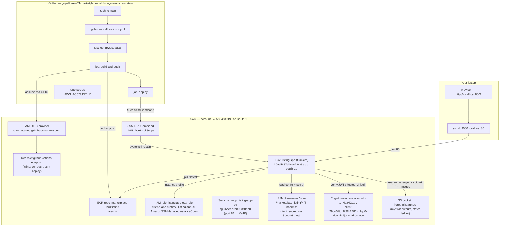

# Infrastructure Resource Map — AWS + GitHub

> Every cloud resource this project uses, and how they connect. Snapshot: **2026-07-02**.
> Account **`048589483919`**, region **`ap-south-1`** (Mumbai) unless noted.
> Companion to [`docs/runbooks/web-ec2-deploy-console.md`](runbooks/web-ec2-deploy-console.md)
> (how to build/operate them) and [`docs/ARCHITECTURE.md`](ARCHITECTURE.md) (the code).

## How it all fits together

---

## AWS resources

### Compute & registry
| Resource | Identifier | Notes |
|---|---|---|
| EC2 instance | `i-0add667d4cec224c6` (name `listing-app`) | `t3.micro`, `ap-south-1b`. **Public IP changes on stop/start.** systemd unit `listing-app.service` re-pulls `:latest` on start (boot = deploy). |
| Instance profile | `listing-app-ec2-role` | Attached to the instance; no access keys in the container. |
| Security group | `sg-06ceeb9a898378bb0` (`listing-app-sg`) | Inbound port **80 from My IP** only. **Do not open `0.0.0.0/0`** — no TLS yet. Egress all (needed for ECR/SSM/Secrets). |
| ECR repository | `marketplace-bulklisting` | URI `048589483919.dkr.ecr.ap-south-1.amazonaws.com/marketplace-bulklisting`. Tags `:latest` (current) + `:<git-sha>`. Lifecycle: keep last 10. |

### Identity (three separate roles — least privilege)
| IAM identity | Type | Policies | Used by |
|---|---|---|---|
| `github-actions-ecr-push` | Role (OIDC, no keys) | inline `ecr-push` (push to ECR), inline `ssm-deploy` (ec2:DescribeInstances + ssm:SendCommand on the tagged instance & AWS-RunShellScript + Get/ListCommand) | CI `build-and-push` + `deploy` jobs |
| `listing-app-ec2-role` | Role (EC2 instance) | `listing-app-runtime` **v2** (ECR pull + S3 `ListBucket`/`Get`/`Put` on `ijorethnicpartners` + SSM `GetParameter` on `/marketplace-listing/*`, incl. SecureString decrypt via the AWS-managed `aws/ssm` key) + AWS-managed `AmazonSSMManagedInstanceCore` (SSM-managed → CI can deploy) | the running app on EC2 |
| OIDC provider | `token.actions.githubusercontent.com` | trust scoped to `repo:gopalthakur71/marketplace-bulklisting-semi-automation:ref:refs/heads/main` | lets GitHub Actions assume the role above without stored keys |

### Configuration & secrets
| Store | Key | Value / note |
|---|---|---|
| SSM Parameter Store | `/marketplace-listing/cognito_client_id` | `29oo5dtqh8j30k2481lmffqb0e` |
| | `/marketplace-listing/cognito_pool_id` | `ap-south-1_NdxNQ1pIz` (capital **I**) |
| | `/marketplace-listing/cognito_domain` | `ijor-marketplace` |
| | `/marketplace-listing/cognito_redirect_uri` | `http://localhost:8000/auth/callback` (localhost = tunnel; stable across IP change) |
| | `/marketplace-listing/s3_bucket` | `ijorethnicpartners` |
| | `/marketplace-listing/s3_prefix` | `myntra/` |
| | `/marketplace-listing/s3_region` | `ap-south-1` |
| SSM **SecureString** | `/marketplace-listing/cognito_client_secret` | Cognito app-client secret (52 chars), encrypted with the AWS-managed `aws/ssm` key; the getter decrypts it with `WithDecryption=True`. **Migrated from Secrets Manager → SSM on 2026-07-02** to drop the ~$0.40/mo Secrets Manager charge (Secrets Manager is no longer used at all). |

> ⚠️ **No trailing whitespace in any of these** — a stray `\n` in `cognito_redirect_uri` once broke login with `redirect_mismatch`. `settings.py` now `.strip()`s values defensively.

### Auth (Cognito)
| Thing | Value |
|---|---|
| User pool | `ap-south-1_NdxNQ1pIz` |
| App client | `29oo5dtqh8j30k2481lmffqb0e` (secret in SSM SecureString `…/cognito_client_secret`) |
| Hosted-UI domain | `ijor-marketplace` (`ijor-marketplace.auth.ap-south-1.amazoncognito.com`, ManagedLogin v2, CloudFront `d19bnlz1qkpkne`) |
| Managed-login branding | id `9a9dc958-8034-4402-b89a-0734d325a439`, `UseCognitoProvidedValues=true` |
| Callback / sign-out URLs | `http://localhost:8000/auth/callback` / `http://localhost:8000/` |
| Flow / scopes | authorization `code`; `openid email phone` (app requests `openid email`) |
| ID-token validity | 8 hours (matches `TOKEN_MAX_AGE` in `auth_routes.py`) |
| Test user | `gopalthakur71@gmail.com` (status `CONFIRMED`) |

### Storage (S3)
| Bucket | Keys | Note |
|---|---|---|
| `ijorethnicpartners` | `state/myntra_groupid.json` (styleGroupId ledger), `state/hsn_kb.json` (HSN knowledge base), `myntra/…` (uploaded product images + outputs) | Instance role needs **ListBucket** too — without it a missing key returns 403 not 404 and the app 500s. |

---

## GitHub resources
| Resource | Value |
|---|---|
| Repository | `gopalthakur71/marketplace-bulklisting-semi-automation` (default branch `main`) |
| Workflow | `.github/workflows/ci-cd.yml` — jobs `test` → `build-and-push` → `deploy` |
| Repo secret | `AWS_ACCOUNT_ID` = `048589483919` (an account number, **not a credential** — OIDC provides short-lived creds) |
| OIDC federation | GitHub presents a token to `token.actions.githubusercontent.com`; AWS trust policy (main branch only) lets it assume `github-actions-ecr-push` |

## Cost shape
- **Idle (box stopped):** ≈ **under $1/mo** — only the ~8 GB EBS root volume + small ECR image storage. SSM params (incl. the SecureString) and Cognito are free tier; S3 is a few cents. **Secrets Manager was removed 2026-07-02** (~$0.40/mo saved).
- **Full per-resource breakdown, scenarios, and cost levers:** [`docs/infra-costs.md`](infra-costs.md).
- **While running:** t3.micro compute (free-tier eligible, else ~$7.5/mo on-demand) + public IPv4 (~$3.6/mo). CloudFront/TLS/public URL **not provisioned** (deferred).

## Not provisioned (deliberately deferred)
- **TLS + public URL** (CloudFront or reverse-proxy + domain) — access stays SSH-tunnel-to-localhost. See the parked discussion; do not open the SG publicly until this exists.
- **Elastic IP** — none; the public IP is ephemeral by design.
